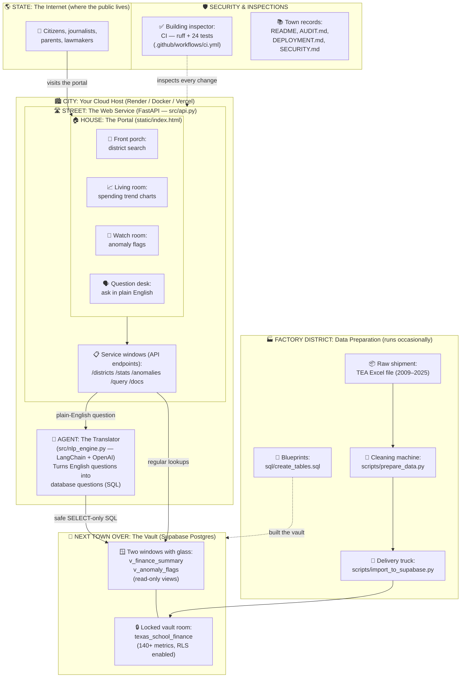

# 🗺️ Project Map — The Whole Neighborhood, Explained Simply

This page explains the entire project like a map of a town — no tech
background needed. (Engineers: the file names in parentheses are real paths.)

## The Big Idea (Why This Town Exists)

Texas has over 1,000 school districts, and together they spend **billions of
taxpayer dollars** every year. The numbers are public, but they're buried in
giant spreadsheets almost nobody can read. This project is like building a
**visitor center** in front of a locked warehouse: anyone can walk in, ask a
question in plain English, and see where the money goes.

## The Map

## The Analogy, Room by Room

| Map piece | Real thing | 8th-grade explanation |
|---|---|---|
| 🌎 **State** | The public internet | Everyone in the world who might visit |
| 🏙️ **City** | Cloud host (Render/Docker/Vercel) | The land the buildings sit on — rented, not owned |
| 🛣️ **Street** | The FastAPI web service (`src/api.py`) | The road every visitor travels; street signs (`/docs`) tell you where things are |
| 🏠 **House** | The portal web page (`static/index.html`) | The visitor center — search, charts, and a help desk in one building |
| 🤖 **Agent** | The NLP engine (`src/nlp_engine.py`) | A translator: you ask "How much does Dallas spend per kid?" and it writes the precise database question for you |
| 🏦 **Vault** | Supabase Postgres database | The bank next door holding 17 fiscal years of money records |
| 🪟 **Windows** | Read-only SQL views | Visitors can *look* through the glass but can't touch or change anything — even the translator only gets window access |
| 🏭 **Factory** | Data prep scripts | Where the state's messy spreadsheet gets cleaned, labeled, and shelved — runs once per yearly data release |
| 🛡️ **Inspector** | CI tests + audits | A building inspector who re-checks the whole town every time anyone changes anything |

## Tools Used (The Toolbox)

| Tool | Job in the town |
|---|---|
| **Python + FastAPI** | The road crew — moves every request quickly |
| **Supabase (Postgres)** | The bank vault — stores the records safely |
| **LangChain + OpenAI** | The translator's brain |
| **Pandas** | The factory's cleaning machine |
| **Plotly / Matplotlib** | The chart artists |
| **GitHub + CI** | The town hall records office + inspector |
| **Docker / Render / Vercel** | Three different plots of land you can build the town on |

## Objectives & The Revenue Question

**Built to execute:** public transparency — let anyone see how Texas school
money is spent, and automatically flag districts whose numbers jump in
suspicious ways (revenue drops >15%, spending spikes >20% with flat
enrollment, etc.).

**Honest answer about money:** as built, this is a *public-service* tool
(MIT-licensed, free). It doesn't charge anyone. If you want it to generate
revenue, the realistic paths are:

1. **Freemium data portal** — the public portal stays free; charge for API
   keys with higher limits, bulk exports, and alerts (journalists, bond
   analysts, real-estate firms, EdTech vendors).
2. **Reports & briefs** — sell district-level anomaly reports or legislative
   briefing packets built from the same data.
3. **Grants & sponsorship** — civic-tech and journalism foundations fund
   exactly this kind of accountability infrastructure.
4. **Consulting wedge** — the portal is the demo; paid work is custom
   analysis for school boards, bond campaigns, or news organizations.

Think of it like a free museum: admission is free, but the gift shop,
private tours, and event rentals pay the bills.

## Where Everything Lives

| What | Where |
|---|---|
| Code (GitHub) | https://github.com/GusAI40/texas-isd-finances |
| Audit branch | [`claude/audit-public-launch-ocd7ra`](https://github.com/GusAI40/texas-isd-finances/tree/claude/audit-public-launch-ocd7ra) |
| Database | Supabase project `texas-isd-finances` (`zwhvabkvrexphlskubog`, us-east-1) — 20,587 records live |
| Live site | **https://txisd.dev** (Vercel, production) |
| Raw data source | Texas Education Agency (TEA) summarized financial data, 2009–2025 |
