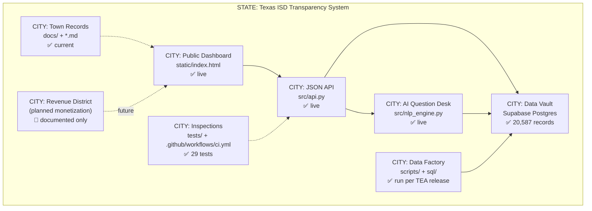
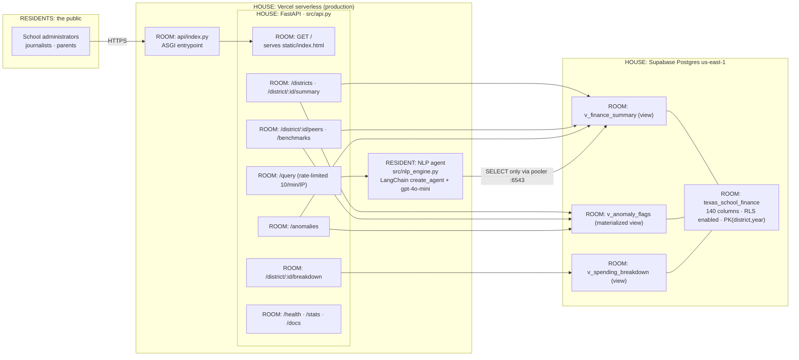
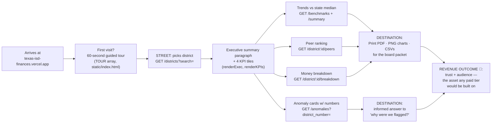
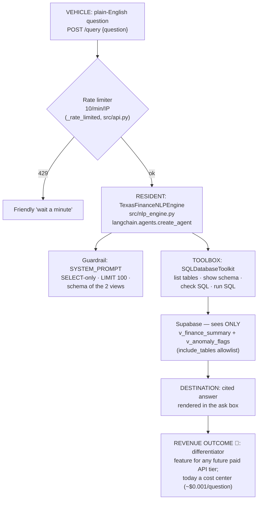
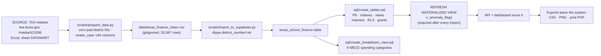
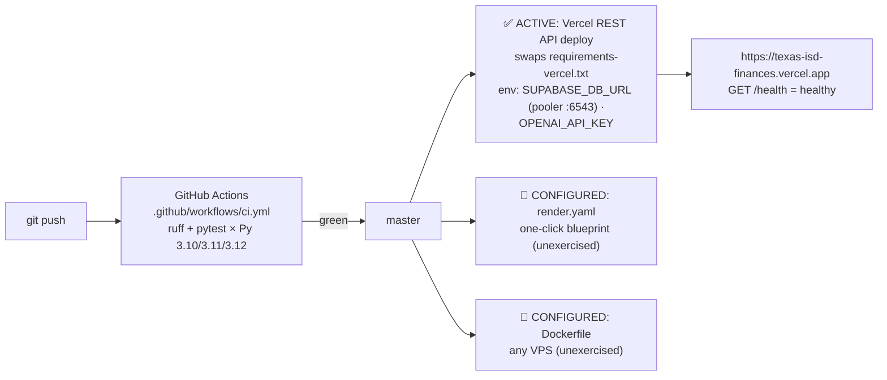
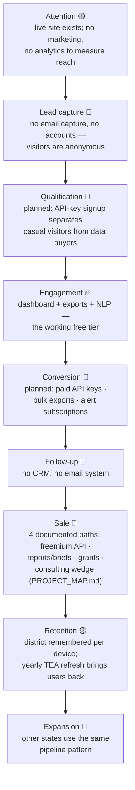

# 🏙️ Repository Blueprint — The City Map

**Verified against:** the actual code, git history, live production, and
connected services on 2026-07-23 (branch `master` @ merge of PR #1). Every
component below carries a repository path and a status. For the friendlier
one-page version, see [PROJECT_MAP.md](PROJECT_MAP.md); for deep technical
detail, see [ARCHITECTURE.md](ARCHITECTURE.md).

**Status legend:** ✅ working & verified · 🟡 partially implemented ·
🔵 documented/planned · 🔴 broken/missing · ⚪ unclear/unverified ·
🗑️ potentially obsolete

---

## 1. Executive Repo Map

The STATE is the whole business; each CITY is a major capability.

## 2. Detailed System Architecture

## 3. Primary Customer Journey

VEHICLE = one administrator's visit. DESTINATION = a board-ready answer.

## 4. Agent-and-Tool Workflow

The one AI RESIDENT and its TOOLBOX (full inventory: [AGENTS.md](AGENTS.md)).

## 5. Data Lifecycle

## 6. Deployment Workflow

## 7. Revenue-Generation Workflow

Honest status: **the product currently earns $0 by design** (MIT, free,
no payment rail, no auth, no analytics). The funnel below shows which
stages exist today (✅) and which are documented plans only (🔵).

---

## Component Inventory (verified, with status)

### Application & data

| Component | Path | Status | Notes |
|---|---|---|---|
| FastAPI service (11 routes) | `src/api.py` | ✅ | Live; lifespan pool, CORS, rate limit |
| Dashboard UI | `static/index.html` | ✅ | v3 white-minimalist; no build step |
| NLP agent | `src/nlp_engine.py` | ✅ | LangChain 1.x `create_agent`; view-scoped |
| Vercel entrypoint | `api/index.py`, `vercel.json` | ✅ | Active production path |
| Supabase DB | project `zwhvabkvrexphlskubog` (us-east-1) | ✅ | 20,587 rows; RLS on base table |
| Schema + views | `sql/create_tables.sql`, `sql/create_breakdown_view.sql` | ✅ | Import-first order (documented) |
| Data prep | `scripts/prepare_data.py` | ✅ | Tested helpers |
| Data import | `scripts/import_to_supabase.py` | ✅ | Leading-zero-safe |
| UX simulation | `scripts/simulate_admin_usage.py` | ✅ | Seeded; results in `docs/simulation_results.json` |
| Chart helper library | `src/visualizations.py` | 🟡 | Works & tested, but **not used by the API or UI** — offline analysis only |
| Sample queries module | `src/sample_queries.py` | ✅ | Dependency-free |

### Operations & quality

| Component | Path | Status | Notes |
|---|---|---|---|
| CI (ruff + pytest ×3 Pythons) | `.github/workflows/ci.yml` | ✅ | Enforcing; green on master |
| Test suite (29 tests) | `tests/` | ✅ | Runs with zero credentials |
| Rate limiter on /query | `src/api.py` `_rate_limited` | 🟡 | Works; per-serverless-instance, not global |
| Render blueprint | `render.yaml` | 🔵 | Spec-validated, never executed |
| Docker image | `Dockerfile`, `.dockerignore` | 🔵 | Written, never built in anger |
| Type checking | — | 🔴 | No mypy/pyright configured |
| Monitoring / uptime alerts | — | 🔴 | Only manual `/health` checks |
| Analytics | — | 🔴 | No usage measurement at all |

### Documentation & memory

| Component | Path | Status |
|---|---|---|
| Boot file + session memory | `CLAUDE.md`, `docs/ENGINEERING_LOG.md`, `.claude/skills/ariba/SKILL.md` | ✅ |
| Audit trail (3 rounds) | `AUDIT.md` | ✅ |
| UX research + tutorial | `docs/UX_RESEARCH.md`, `docs/TUTORIAL.md` | ✅ |
| Launch runbook | `DEPLOYMENT.md`, `RUNBOOK.md` | ✅ |
| Env reference | `ENVIRONMENT.md`, `env_template.txt` | ✅ |
| This blueprint | `REPO_MAP.md`, `ARCHITECTURE.md`, `AGENTS.md` | ✅ |

### External services

| Service | Role | Status | Evidence |
|---|---|---|---|
| Vercel (`tag-ai` / project `texas-isd-finances`) | Hosting | ✅ | `/health` returns healthy |
| Supabase (org GOAT-UIX) | Postgres + REST | ✅ | Live queries |
| OpenAI (gpt-4o-mini) | NLP model | ✅ | Live `/query` verified |
| TEA (tea.texas.gov) | Data source | ✅ | Current release ingested |
| GitHub Actions | CI | ✅ | Green check runs |
| Authentication provider | — | 🔴 none | Public read-only by design; becomes required for any paid tier |
| Queues / schedulers / webhooks | — | 🔴 none | Data refresh is manual, once per TEA release |

### Potentially obsolete (evidence before removal)

| Item | Evidence | Risk of removal |
|---|---|---|
| 🗑️ `src/visualizations.py` | No imports from `src/api.py` or `static/`; only `tests/test_visualizations.py` references it | Low risk to the app — but it's the only Python charting utility for offline reports (a documented revenue path). **Keep** until the reports product is decided. |
| 🗑️ matplotlib/seaborn/plotly in `requirements.txt` | Only used by `src/visualizations.py` | Removing shrinks local installs; keep while the file stays. Already excluded from production deploys via `requirements-vercel.txt`. |
