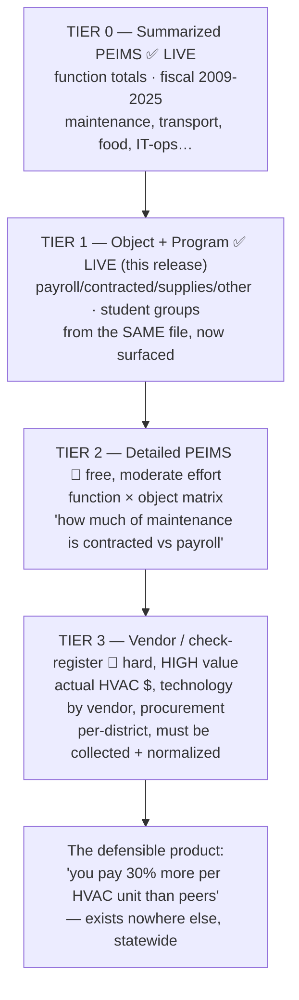

# Data Roadmap — From "where the money goes" to "HVAC & technology"

What each data layer unlocks, its effort, and its strategic payoff. Written
against the real constraints of the TEA data (verified July 2026).

## The granularity ladder

TEA financial data is coded on four dimensions: **fund** (general/federal/
debt/…), **function** (the activity), **object** (what was bought), and
**program intent** (who it served). "HVAC" and "technology" are more
granular than any of these summary dimensions — that's the core constraint.

## Where each thing you'd want actually lives

| You want | Reachable from | Status |
|---|---|---|
| Maintenance & operations total (incl. HVAC, utilities, custodial) | Tier 0 function 51 | ✅ live |
| Central IT operations | Tier 0 function 53 | ✅ live (labeled honestly as *not* total tech) |
| People vs. outside-services vs. supplies | Tier 1 object | ✅ live this release |
| Spending per student group (special-ed, bilingual, CTE…) | Tier 1 program | ✅ live this release |
| "Maintenance that is contracted services vs. in-house payroll" | Tier 2 function × object | 🔵 detailed PEIMS |
| **HVAC specifically** | Tier 3 vendor / account-code detail | 🔵 not in any TEA summary — needs collection |
| **Total technology** (devices + infra + telecom) | Tier 3 vendor + E-rate | 🔵 smeared across objects/funds; must be assembled |

## Tier 2 — Detailed PEIMS (free, ~2–3 days)

TEA publishes actual financial data at full function × object × program ×
fund granularity ("PEIMS Financial Standard Reports" / the detailed
downloads). This crosses the two dimensions we currently show separately,
so you could answer *"of that $190M Dallas maintenance line, how much was
contracted building services vs. in-house staff vs. supplies."* Still not
"HVAC," but one real level deeper.
- **Effort:** new ETL for a larger, differently-shaped file; a
  `v_spending_matrix` view; a drill-down UI on the money breakdown.
- **Risk:** file size/shape differs from the summarized release; the
  object codes are coarse (6100 payroll … 6600 capital), so HVAC is still
  not a line — it would sit inside object 6249 (contracted building
  maintenance) mixed with roofing, plumbing, etc.

## Tier 3 — Vendor / check-register data (hard, the real unlock)

This is the only place "HVAC" and "technology by vendor" exist as real
numbers — *"paid $2.1M to Trane," "$4M to Apple."* Texas transparency law
requires districts to publish vendor/accounts-payable data, but:
- It's **per-district**, published in wildly different formats (PDF, CSV,
  portal exports), often only for recent years.
- Vendor names need **normalization** ("TRANE US INC" = "Trane" = "Trane
  Inc") and **categorization** (map vendor → HVAC / technology / food /
  construction) — the actual hard, valuable work.

### Vendor pilot scope — one district (~1 week)
1. **Pick a target** (a mid-size district that publishes a clean check
   register — e.g. a suburban ISD with an open-data portal).
2. **Ingest** one fiscal year of AP/check-register rows (vendor, amount,
   date, sometimes a fund/function code).
3. **Normalize vendors** (fuzzy-dedupe to canonical names) and **classify**
   the top ~200 vendors by spend into categories (HVAC, technology,
   construction, food, transportation, professional services…) — a mix of
   a lookup table + an LLM classifier with human review.
4. **Reconcile** the vendor total against the district's TEA object totals
   as a sanity check (they won't match exactly — timing, funds — but should
   be the right order of magnitude).
5. **Output:** a "what this district actually bought, by category and
   vendor" view for one district — the demo that proves the concept.
- **Outcome:** if it works for one district, the same pipeline generalizes;
  ~20–30 large districts would cover the majority of statewide spend and
  make **procurement benchmarking** possible ("your district pays X% more
  per HVAC dollar than similar districts") — which is genuinely unique.

## Complementary datasets (multiply the value of what you have)

| Dataset | Source | Unlocks |
|---|---|---|
| **TAPR academic outcomes** | TEA | spending → results ("does more $/student improve scores?") — the #1 grant/press narrative |
| **PEIMS staff / FTE** | TEA | salaries, staffing ratios, teacher pay vs. admin overhead |
| **Facilities (age, sq ft)** | TEA / district | normalize maintenance & HVAC as **$/sq-ft** (the correct denominator for buildings, not $/student) |
| **Bond official statements** | MSRB EMMA / MAC Texas | itemized capital projects — decomposes the capital line into new HVAC, roofing, etc. |
| **E-rate funding** | FCC USAC | federally-subsidized technology/telecom spend (a chunk of true "tech") |
| **Enrollment demographics** | TEA | equity analysis (spend vs. econ-disadvantaged / ELL / SpEd share) |

## Strategic payoff (why this matters)

The current product shows a nicer view of data TEA, the Comptroller, and
NCES already publish free — so it competes with free. The value ladder:

- **Tier 2** → deeper, still free-adjacent.
- **Tier 3 (vendor) + TAPR outcomes** → analysis that **exists nowhere
  else**: procurement benchmarking and spending-to-results. That is the
  ground a paid product (reports, benchmarking subscriptions, consulting)
  can actually stand on.

**Recommended next step:** run the one-district vendor pilot (Tier 3, step
1–5) on a single clean-data district. One working demo answers "can we
really get to HVAC/technology?" definitively and de-risks everything above
it — far more informative than building Tier 2 in full first.
