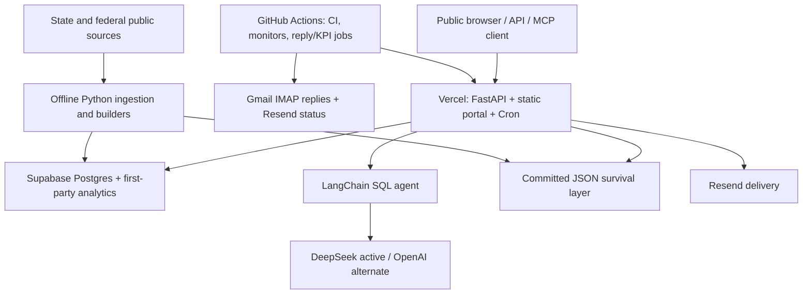

# Technology Stack Forensic and Official Agent Skills Map

> **Audit state:** evidence-backed inventory, adoption plan, and hardening
> record; no external vendor skill is committed to the application.
>
> **Verified:** 2026-08-22, beginning with the PR #52 documentation baseline
> on `master` at `9b42a05ec6149979a7d4d1aeefbd60d76b3b483c` and continuing
> through the operational-hardening change, read-only live checks, and the
> publisher-owned sources linked below. Repository, merge, and deployment
> evidence are deliberately separate.

## Executive finding

Texas ISD Finances is not just a FastAPI application attached to Supabase.
The live system is a Vercel-hosted Python service with a static-data survival
layer, a LangChain SQL agent, DeepSeek as the active model provider, Supabase
Postgres, two Vercel Cron jobs, GitHub Actions monitoring, Resend delivery,
first-party analytics, and a hand-written public MCP server. The hardening
change replaces the archived `langchain-community` toolkit with
application-owned SQL tools and a SQLGlot AST policy. A larger offline Python toolchain
builds the committed public-data artifacts from state and federal sources.
Docker and Render exist as alternatives, not live production deployments;
OpenAI is a configuration-selected alternate and Mapbox is an optional
upgrade, not the current core path. There is no automatic failover from
DeepSeek to OpenAI after a request failure.

Read-only production checks on 2026-08-22 established that:

- `https://txisd.dev/health` reported healthy, database connected, and
  `deepseek:deepseek-v4-flash` configured.
- `/api/cron/runs` showed the daily `isd-intelligence` job completed that day,
  wrote 372 rows, and had no gap or empty successful runs in its window.
- The same endpoint showed `outreach-drain` firing but `unarmed`; this is an
  external Vercel configuration blocker, not a healthy idle queue.
- `/.well-known/mcp.json` advertised the live, read-only `/mcp` endpoint.

Repository remediation and live adoption are tracked separately below. A
green source tree, merge, or deployment never substitutes for post-deploy
verification of the matching revision.

Publisher-owned or publisher-hosted Agent Skills material exists for the
parts of this stack where current procedural knowledge matters most: FastAPI,
Pydantic, Supabase/Postgres, Vercel, LangChain, Resend, Mapbox, GitHub
workflows, OpenAI/Codex, Render, and Claude/Anthropic. Google publishes Gmail
skills inside its Workspace CLI repository, but that catalog explicitly is
not an officially supported Google product and does not match this app's IMAP
implementation. The right first move is to document and review these skills,
not install all of them. Several packs contain scripts or mutable operations,
and generic vendor advice must never override this project's database,
privacy, deployment, or outreach invariants.

Agent Skills improve engineering and operating workflows. They are not
application runtime dependencies and none is added to production by this
guide.

## Navigate this forensic

| Need | Section |
|---|---|
| Architecture and active products | [System topology](#system-topology) and [complete stack](#complete-application-and-infrastructure-stack) |
| Optional, development, and source products | [Configured paths](#configured-optional-and-alternate-paths), [toolchain](#development-and-offline-data-toolchain), and [data sources](#external-public-data-and-discovery-sources) |
| Credential/config names | [Configuration surface](#configuration-surface) |
| Which official skills exist | [Availability audit](#official-agent-skills-availability-audit) and [trust check](#reproducibility-and-trust-check) |
| How, where, and why to use them | [Usage map](#how-where-and-why-to-use-the-relevant-skills) |
| What may be installed or operated | [Adoption and authority](#adoption-and-authority-model) |
| Risks and maintenance | [Remediation status](#forensic-remediation-status), [negative findings](#deliberate-negative-findings), and [maintenance](#maintenance-checklist) |

## Scope and evidence rules

This audit uses four statuses:

| Status | Meaning |
|---|---|
| **Production-active** | The live request, storage, delivery, deployment, or monitoring path uses it, supported by code/config and, where possible, a live read. |
| **Configured/optional** | A real integration or alternate path exists, but it is token-, secret-, feature-flag-, or operator-dependent, or is not the live deployment. |
| **Development-only** | Used to build data, test, lint, analyze, publish, or operate the project; not imported by the Vercel request bundle. |
| **Data-source-only** | An upstream publisher, catalog, feed, or API supplies evidence; it is not application infrastructure. |

Evidence precedence is: executable code and deployment configuration, then a
read-only live check, then current repository documentation, then inference.
When those disagree, this guide records the disagreement instead of blending
the claims. Direct dependencies and services are inventoried; ordinary
transitive packages are not treated as separately selected products.

For skills, **official** means one of:

1. the product publisher owns the repository or ships the skill with the
   library;
2. the publisher's documentation points to it; or
3. for GitHub's `awesome-copilot`, GitHub owns and documents the collection,
   while individual entries remain explicitly community-authored.

A marketplace listing, a `skills.sh` entry, or a repository name that merely
contains a vendor name is not sufficient proof.

## System topology

## Complete application and infrastructure stack

### Production-active request, data, and operations path

| Layer | Product or technology | What it does here | Repository evidence | Official skills status |
|---|---|---|---|---|
| Language | Python `>=3.10,<3.13`; CI tests 3.10, 3.11, and 3.12 | Runs the API, agent, migrations, jobs, and offline builders. Vercel targets 3.12; the alternate Docker and Render paths pin 3.12.14 on this branch. | `pyproject.toml`, `Dockerfile`, `render.yaml`, `.github/workflows/ci.yml` | No PSF product skill located. |
| API | FastAPI | ASGI application, public JSON API, static pages, auth gates, cron handlers, and OpenAPI schema. | `src/api.py`, `api/index.py` | **Yes:** versioned `fastapi` library skill. |
| Validation | Pydantic 2 | Request/response models and validation. | `src/api.py`, `pyproject.toml`, `uv.lock` | **Yes:** Pydantic's standalone `pydantic` skill; the FastAPI skill also covers common integration patterns. |
| Database runtime | `asyncpg` | Async connection pool to the Supabase transaction pooler; statement caching is disabled for pooler compatibility. | `src/api.py` (`get_pool`) | No driver skill; use Supabase/Postgres guidance. |
| SQL/DB adapter | SQLAlchemy 2 + `psycopg2-binary` | LangChain SQL access and synchronous import/operator paths. | `src/nlp_engine.py`, `scripts/import_to_supabase.py`, runtime requirements | No publisher Agent Skills pack located. |
| SQL policy parser | SQLGlot 30.17.0 | Parses PostgreSQL before model-authored SQL executes. An exact node/function allowlist rejects unreviewed syntax, session-affecting functions, table sampling, custom operators, recursive CTEs, user-defined types, and relations outside the two public finance views. | `src/nlp_engine.py`, `tests/test_nlp_engine.py`, `pyproject.toml`, `uv.lock` | No publisher Agent Skills pack located. Use the publisher's [AST primer](https://github.com/tobymao/sqlglot/blob/main/posts/ast_primer.md) as documentation, not as a skill. |
| Configuration | `python-dotenv` + environment variables | Local environment loading and deploy-time configuration. | `src/api.py`, `src/nlp_engine.py`, `env_template.txt` | No publisher skill located. |
| Primary database | Supabase hosted Postgres and pooler | Finance views, analytics, outreach state, tracking, cron ledger, RLS, and least-privilege NLP role. | `sql/`, `src/migrations.py`, `src/api.py`, `PROJECT_MAP.md` | **Yes:** `supabase` and `supabase-postgres-best-practices`. |
| Startup schema/security refresh | Application-owned idempotent DDL through `asyncpg` | Checks tracking, intelligence, and outreach sentinels plus journey-view and cron-privacy markers; creates missing objects and refreshes application-owned views, constraints, and grants. The bounded cron repair nulls unsafe legacy detail. It never mutates finance data. | `src/migrations.py`, `tests/test_migrations.py` | Supabase/Postgres skills are relevant, but repository migration invariants take precedence. |
| Primary hosting | Vercel Python serverless | Runs the ASGI entrypoint behind `txisd.dev`; provides deploys, function execution, CDN behavior, and custom-domain routing. | `api/index.py`, `vercel.json`, `.vercelignore`, `.github/workflows/deploy.yml` | **Yes:** `vercel-optimize`, `vercel-cli-with-tokens`, and `web-design-guidelines`; `deploy-to-vercel` is conditional. |
| Vercel Git deploy verifier | Secret-free post-merge gate | Waits for `/health` to report the expected Git SHA, healthy/connected runtime state, and `tracking_schema=ready`, then runs strict live checks. | `.github/workflows/deploy.yml`, `scripts/verify_live.py`, `src/api.py`; [official system-variable reference](https://vercel.com/docs/environment-variables/system-environment-variables) | Vercel and GitHub workflow skills apply. It verifies rather than deploys; the duplicate CLI deploy path was removed. |
| Scheduling | Vercel Cron | Daily district-intelligence refresh and daily outreach queue drain. | `vercel.json`, `/api/cron/isd-intelligence`, `/api/cron/outreach-drain` | Covered by Vercel material; repository-specific auth and idempotency rules remain authoritative. |
| Static data tier | Committed JSON and images in `static/` | Serves most report layers without a live database and keeps the portal useful during a DB outage. | `static/*.json`, artifact loaders and routes in `src/api.py` | No vendor skill; project invariants and artifact tests govern it. |
| Frontend | Handwritten HTML, CSS, and ES JavaScript | Portal, reports, first-party tracking, Canvas/SVG visualizations, and fetch-based API calls with no frontend build. | `static/*.html`, `static/design.css`, `static/ask.js`, `static/track.js` | Vercel `web-design-guidelines` is relevant; React/Next.js skills are not. |
| AI framework | LangChain 1.x | Creates the tool-using SQL agent and connects it to the finance SQL adapter. | `src/nlp_engine.py`, `pyproject.toml`, `uv.lock` | **Yes:** `ecosystem-primer`, `langchain-dependencies`, `langchain-fundamentals`, and selectively `langchain-middleware`. |
| SQL agent tools | Application-owned LangChain tools | Replaces archived `langchain-community` with SQLAlchemy-backed list/schema/check/query tools; requires `NLP_DB_URL`, limits discovery/schema tools to two finance views, caps visible rows at 100, qualifies approved views as `public.*`, sets `search_path` to `pg_catalog`, and executes under a read-only transaction with a 20-second timeout. The `nlp_reader` grants remain the final authorization boundary. | `src/nlp_engine.py`, `tests/test_nlp_engine.py`, `sql/create_nlp_role.sql` | Uses LangChain's current direct-tool pattern; there is no separate SQL-toolkit skill. SQLGlot is the separately declared parser dependency. |
| Provider adapter | `langchain-openai` + OpenAI SDK | Uses `ChatOpenAI` for both OpenAI and DeepSeek's compatible API. | `src/llm_config.py`, `src/nlp_engine.py` | LangChain pack plus OpenAI troubleshooting only when OpenAI is selected. |
| Active LLM | DeepSeek API, `deepseek-v4-flash` | Current `/query` model and optional news extraction provider when enabled. | `src/llm_config.py`, `.github/workflows/llm-balance.yml`; confirmed by live `/health` | No app-relevant publisher Agent Skills pack was located. |
| Email delivery | Resend API | Sends queued superintendent outreach and supplies delivery status for KPI snapshots. | `src/outreach_email.py`, `src/outreach_runner.py`, `scripts/outreach_kpi.py` | **Yes:** `resend`, `email-best-practices`, and optionally `resend-cli`. |
| Source control | GitHub | Canonical public repository and pull-request history. | Git remote and `PROJECT_MAP.md` | **Yes:** GitHub-owned `awesome-copilot` collection; mixed community authorship. |
| CI/monitoring | GitHub Actions | Tests Python 3.10-3.12, parses browser JS, monitors live health/drift/freshness, checks LLM balance, ingests replies, and snapshots outreach KPIs. | `.github/workflows/*.yml` | **Yes:** `github-actions-hardening`, `github-actions-efficiency`, and related workflow skills. |
| Analytics | First-party events and aggregates in Supabase | Counts traffic and recipient journeys without Vercel Analytics; public reply logs expose counts only. | `src/analytics.py`, `src/tracking.py`, `src/intel.py`, `sql/create_analytics.sql`, `sql/create_visitor_tracking.sql` | Supabase skills apply; project privacy rules override generic analytics advice. |
| Agent interface | Hand-written Model Context Protocol 2026-07-28 endpoint | Exposes 11 deterministic, read-only tools over committed artifacts; each result carries data limits. | `src/mcp_protocol.py`, `src/mcp_tools.py`, `docs/MCP.md` | Anthropic `mcp-builder` is useful for review; do not assume SDK handshake behavior matches this stateless implementation. |
| News inputs | TEA newsroom HTML + Google News RSS | Supplies the daily district-intelligence feed. | `scripts/isd_intel.py`, cron path in `src/api.py` | No relevant publisher-owned skill pack located. |

### Configured, optional, and alternate paths

| Product or technology | Status and role | Evidence | Important boundary |
|---|---|---|---|
| OpenAI API, default `gpt-4o-mini` | Configuration-selected alternate when `NLP_PROVIDER=openai`, or the default when no provider is forced and no DeepSeek key exists. | `src/llm_config.py`, `DEPLOYMENT.md` | Not the provider reported live on 2026-08-22; this is selection, not automatic request failover. |
| Mapbox GL JS | Optional enhancement for `/heatmap`, dynamically loaded from Mapbox CDN when a public token is configured. | `static/heatmap.html`, `/mapbox-token`, Mapbox CSP in `src/api.py` | `/geomap` is vendor-free Canvas; Mapbox is not required for the core map. |
| Gmail-compatible IMAP | Credential-dependent inbound reply job using Python's standard library and a Gmail App Password by default. | `scripts/ingest_replies.py`, `.github/workflows/replies.yml` | If secrets are absent, a manual run is a readiness probe; a scheduled run warns, records `NOT CONFIGURED`, and fails so an unobserved opt-out cannot look green. Google's Workspace CLI skills target a different API/CLI path. |
| Docker + Uvicorn | Portable alternate image/runtime with Python 3.12.14 and the official multi-platform manifest digest. | `Dockerfile`, `pyproject.toml`, `uv.lock` | Not the live production host. |
| Render + Uvicorn | Blueprint-based alternate host, aligned on Python 3.12.14, DeepSeek selection, and the universal lock on this branch. | `render.yaml` | Not the live production host. Render publishes conditional skills for Blueprints, web services, environment variables, Docker, deployment, debugging, and monitoring. |
| Optional LLM news extraction | Feature-flagged extraction with a hard call budget. | `ISD_LLM_EXTRACT` path in `src/api.py` | Off unless explicitly enabled. |
| Supabase Management API | PAT-authenticated operator path for schema/data synchronization and reply/KPI jobs. | `scripts/sync_outreach_contacts.py`, `scripts/ingest_replies.py`, `scripts/outreach_kpi.py` | Not the normal live request data path; mutable calls require explicit target verification. |
| GitHub Releases API | Optional raw-data archive publishing. | `scripts/archive_raw_data.py` | Upload requires `GITHUB_TOKEN`; local archive creation does not. |

### Development and offline data toolchain

| Purpose | Products and libraries | Evidence |
|---|---|---|
| Package/build resolution | `uv==0.11.33` plus one universal `uv.lock` added by this hardening change; Vercel installs the base runtime, while CI, Docker, and Render select reviewed extras/groups from the same graph | `pyproject.toml`, `uv.lock`, workflows, `Dockerfile`, `render.yaml` |
| Testing | pytest and HTTPX from the locked `dev` dependency group | `tests/`, `pyproject.toml`, `uv.lock` |
| Linting | Ruff | `pyproject.toml`, `.github/workflows/ci.yml` |
| Browser-script syntax gate | Node.js `--check` | `scripts/check_static_js.py`, CI workflow |
| Data frames and numeric work | pandas and NumPy | `scripts/prepare_data.py`, multiple `scripts/build_*.py` files |
| Excel ingestion | openpyxl and xlrd | `requirements.txt`, `scripts/build_national_data.py`, TEA import paths |
| Offline visualizations | Matplotlib, Seaborn, and Plotly | `src/visualizations.py`, `requirements.txt` |
| Shapefile processing | pyshp | `scripts/build_district_geo.py`, `scripts/simulate_map_value.py` |
| Social-card rendering | Pillow | `scripts/build_share_cards.py` |
| Network clients | Primarily Python standard-library `urllib` and `imaplib` | ingestion, verification, outreach, and monitoring scripts |

NumPy and Pillow are now direct `offline` dependencies and remain mirrored in
`requirements.txt`. The hardening change adds one cross-platform `uv.lock`
for Python 3.10-3.12; Vercel uses only the base runtime, Docker and Render add
the `server` extra, and CI installs all extras plus `dev`. Requirements files
are compatibility mirrors, not a second resolution authority.

### Reproducible runtime and CI pins

These are repository controls. Production adoption always requires an
independently verified deployment of the matching tree.

| Control | Exact repository state | Evidence |
|---|---|---|
| Python compatibility | `>=3.10,<3.13`; CI matrix 3.10/3.11/3.12; Docker and Render 3.12.14 | `pyproject.toml`, `.github/workflows/ci.yml`, `Dockerfile`, `render.yaml` |
| Resolver | `uv==0.11.33`; `uv lock --check` and `uv sync --locked` gates | CI, Docker, Render, README/runbooks |
| Locked request runtime | FastAPI 0.141.1, Pydantic 2.13.4, SQLAlchemy 2.0.52, asyncpg 0.31.0, psycopg2-binary 2.9.12, python-dotenv 1.2.3 | `uv.lock` |
| Locked agent runtime | LangChain 1.3.16, LangChain Core 1.6.0, `langchain-openai` 1.6.0, OpenAI SDK 2.54.0, SQLGlot 30.17.0; no `langchain-community` | `uv.lock` |
| CI actions | `actions/checkout` v7.0.1 at `3d3c42e5aac5ba805825da76410c181273ba90b1`; `actions/setup-python` v7.0.0 at `5fda3b95a4ea91299a34e894583c3862153e4b97`; read-only workflow tokens and no persisted checkout credentials | `.github/workflows/*.yml` |
| Production verification | No deploy CLI or deploy secrets in Actions; the verifier requires the exact Git SHA, healthy/connected database state, and `tracking_schema=ready`, then retries strict live checks after Git-driven production changes. Readiness proves startup observed the three sentinels, current journey-view marker, and cron-privacy marker when the optional cron table exists; it is not a continuous grants audit. | `.github/workflows/deploy.yml`, `scripts/verify_live.py`, `src/api.py` |
| Container base | `python:3.12.14-slim-bookworm` at manifest digest `sha256:a116514e…a78134` | `Dockerfile` |
| Update path | Weekly reviewable Dependabot PRs for `uv`, GitHub Actions, and Docker | `.github/dependabot.yml` |

## External public-data and discovery sources

These are evidence providers, not runtime frameworks. Their provenance and
freshness rules live in `src/sources.py`, `scripts/freshness_vintages.json`,
`static/sources.html`, and the ingestion/build scripts.

| Publisher/product | Data used |
|---|---|
| Texas Education Agency | Summarized PEIMS actual finance; Snapshot; STAAR district aggregates; A-F accountability; property/tax inputs; excess-local-revenue/recapture; AskTED superintendent directory; newsroom releases |
| Texas Comptroller | Property values and tax-rate inputs used with TEA records |
| Texas Bond Review Board | School bond election record and debt register |
| Texas Open Data / Socrata | Transport for Bond Review Board and AskTED datasets |
| U.S. Census Bureau | F-33 school finance and TIGER/Line school-district boundaries |
| National Center for Education Statistics | NPEFS state finance and CCD LEA directory bridge |
| Universal Service Administrative Company / FCC E-Rate | FRN status and supplemental entity information |
| U.S. Bureau of Labor Statistics | CPI-U |
| Texas Assessment Research Portal / Cambium | Current STAAR bulk-data path; access constraints are documented in project freshness notes |
| Google News RSS | Keyless discovery feed for district news |

No publisher-owned Agent Skills repositories relevant to these ingestion
formats were located. Treat the project's source-specific builders,
provenance tests, and freshness checks as the authoritative procedures.

## Configuration surface

Names are recorded so operators can map integrations without exposing values.

### Protected credentials

- Database and model: `SUPABASE_DB_URL`, `NLP_DB_URL`, `SUPABASE_PAT`,
  `DEEPSEEK_API_KEY`, `OPENAI_API_KEY`.
- Delivery and mailbox: `RESEND_API_KEY`, `IMAP_PASSWORD`.
- Application gates: `CRON_SECRET`, `OPS_TOKEN`, `OUTREACH_TOKEN`,
  `SITE_PASSWORD`.
- Manual operator deployment and release publishing: `VERCEL_TOKEN`,
  `GITHUB_TOKEN`. The Actions production verifier needs neither.

### Non-secret or operational configuration

- Model selection: `NLP_PROVIDER`, `NLP_MODEL`, `NLP_BASE_URL`,
  `NLP_TEMPERATURE`.
- API and security: `CORS_ALLOW_ORIGINS`, `MCP_ALLOWED_ORIGINS`,
  `SITE_USERNAME`.
- Query budgets: `QUERY_RATE_LIMIT`, `QUERY_GLOBAL_LIMIT`,
  `QUERY_DAILY_LIMIT`, `QUERY_DEGRADED_LIMIT`, `QUERY_TIMEOUT_SECONDS`.
- Data and intelligence: `DATA_MIN_YEAR`, `DATA_MAX_YEAR`,
  `ISD_PRIORITY_DISTRICTS`, `ISD_MAX_QUERIES`, `ISD_LLM_EXTRACT`,
  `ISD_LLM_MAX_CALLS`.
- Outreach: `RESEND_FROM`, `RESEND_REPLY_TO`, `TAG_BCC`,
  `TAG_POSTAL_ADDRESS`, `IMAP_USER`, `IMAP_HOST`.
- Operator/platform: `SUPABASE_PROJECT_REF`, `VERCEL_PROJECT`,
  `VERCEL_TEAM`, `SITE_URL`, `ARCHIVE_OUT_DIR`, `PORT`, `PYTHON_VERSION`,
  `VERCEL_GIT_COMMIT_SHA`. The last is a non-secret Vercel system variable;
  expose System Environment Variables to the function or `/health` reports
  `revision=local` and strict deploy verification fails.
- `MAPBOX_TOKEN` is deliberately returned to the browser and must be a
  URL-restricted public `pk.` token, not a secret token.

`NLP_DB_URL` is mandatory for `/query`. If it is absent,
the feature stays unavailable instead of falling back to the database owner.
The unused `SUPABASE_URL` and `SUPABASE_ANON_KEY` placeholders were removed
from `env_template.txt`; neither has a code reference.

## Official Agent Skills availability audit

### Summary matrix

| Stack owner | Official source | Relevant skills | Adoption decision |
|---|---|---|---|
| FastAPI | [`fastapi/fastapi` library skill at 0.141.1](https://github.com/fastapi/fastapi/tree/0.141.1/fastapi/.agents/skills/fastapi) | `fastapi` | **Recommended for matching API work, version-matched.** High relevance to `src/api.py`; select the upstream tag matching the resolved FastAPI release. |
| Pydantic | [`pydantic/skills`](https://github.com/pydantic/skills) | `pydantic` | **Optional.** Use for non-trivial model, validation, settings, and serialization work; basic API integration is already covered by the FastAPI skill. |
| Supabase | [`supabase/agent-skills`](https://github.com/supabase/agent-skills) and [Supabase skill docs](https://supabase.com/docs/guides/ai-tools/ai-skills) | `supabase`, `supabase-postgres-best-practices` | **Recommended for matching DB work.** Highest-value pair for pooling, migrations, RLS, grants, and query review. |
| Vercel | [`vercel-labs/agent-skills`](https://github.com/vercel-labs/agent-skills) | `vercel-optimize`, `vercel-cli-with-tokens`, `web-design-guidelines`; conditional `deploy-to-vercel` | **Candidate for matching Vercel work.** Optimize live functions/caching and review the native portal; use deployment material only for an explicitly authorized deploy path and exclude React guidance. |
| LangChain | [`langchain-ai/langchain-skills`](https://github.com/langchain-ai/langchain-skills) | `ecosystem-primer`, `langchain-dependencies`, `langchain-fundamentals`; conditional `langchain-middleware`; later `eval-engineering` | **Candidate with extra review.** The pack calls itself early development; pin and review before use. |
| Resend | [`resend/resend-skills`](https://github.com/resend/resend-skills) | `resend`, `email-best-practices`, optional `resend-cli` | **Recommended for matching email review.** Do not replace durable opt-out and aggregate-log rules with generic examples. |
| Mapbox | [`mapbox/mapbox-agent-skills`](https://github.com/mapbox/mapbox-agent-skills) | `mapbox-token-security`, `mapbox-web-integration-patterns`, `mapbox-web-performance-patterns`, `mapbox-data-visualization-patterns`, `mapbox-style-quality`; optional `mapbox-mcp-devkit-patterns` | **Feature-specific only.** Load for `/heatmap`, not for the core Canvas map. |
| GitHub | [`github/awesome-copilot`](https://github.com/github/awesome-copilot) and its [skills catalog](https://github.com/github/awesome-copilot/blob/main/docs/README.skills.md) | `github-actions-hardening`, `github-actions-efficiency`, `create-github-action-workflow-specification`, `secret-scanning`, `codeql` | **Use after content review.** GitHub owns the collection, but the repository describes it as community-created. |
| OpenAI / Codex | Current [`openai/plugins`](https://github.com/openai/plugins) catalog and [Codex skills/plugins docs](https://developers.openai.com/codex/skills-and-plugins) | `openai-api-troubleshooting`, `openai-platform-api-key`; GitHub workflows `github`, `gh-fix-ci`, `gh-address-comments`; optional `security-diff-scan` | **Use on matching work through the supported plugin mechanism.** The older `openai/skills` catalog is deprecated; OpenAI Developers plugin content is proprietary, so do not copy or vendor it. |
| Render | [`render-oss/skills`](https://github.com/render-oss/skills) | `render-blueprints`, `render-web-services`, `render-env-vars`, `render-docker`, `render-deploy`, `render-debug`, `render-monitor` | **Conditional.** Use only if `render.yaml` becomes an active deploy target. |
| Google Workspace CLI | [`googleworkspace/cli`](https://github.com/googleworkspace/cli) | `gws-gmail`, `gws-gmail-read`, `gws-gmail-watch`, `gws-gmail-triage` | **Do not adopt for the current path.** The catalog targets the Google API/CLI, not `imaplib`, and the repository says the CLI is not an officially supported Google product. |
| Anthropic / Claude | [`anthropics/skills`](https://github.com/anthropics/skills) | `mcp-builder`, `skill-creator` | **Development-only.** Useful for the custom MCP surface and the existing `.claude/skills`, not an application runtime dependency. |

### Reproducibility and trust check

The following revisions were inspected during this audit. They are review
evidence, not automatic dependency pins. Before adopting a skill, re-check the
specific files and use a project-approved commit or release.

| Source | Reviewed revision | License/maturity observation |
|---|---|---|
| `fastapi/fastapi` | tag [`0.141.1`](https://github.com/fastapi/fastapi/tree/0.141.1/fastapi/.agents/skills/fastapi), `95f8322` | MIT. The current universal lock resolves FastAPI 0.141.1; production remains on its deployed graph until this branch ships. |
| `supabase/agent-skills` | [`8331f91`](https://github.com/supabase/agent-skills/commit/8331f910845103c08d51f6ca1d86ebb7d1f745e3) | MIT; publisher docs also point to the repository. |
| `pydantic/skills` | [`e5f7cb1`](https://github.com/pydantic/skills/commit/e5f7cb13d01561fe3735040ed37596abd9b83976) | MIT. |
| `vercel-labs/agent-skills` | [`dd089a8`](https://github.com/vercel-labs/agent-skills/commit/dd089a8c752c966dee8bf0f27cb625ba193ffd9e) | README says MIT, but no top-level `LICENSE` was present at the inspected revision; link/install only until clarified. |
| `langchain-ai/langchain-skills` | [`7f00812`](https://github.com/langchain-ai/langchain-skills/commit/7f00812b2b8b3022f766a223db579dd381a23813) | Early-development warning; no top-level `LICENSE` was present at the inspected revision. |
| `resend/resend-skills` | [`2a69b9f`](https://github.com/resend/resend-skills/commit/2a69b9f39a16c043cbfad45fbfa3c141bd27b050) | MIT. |
| `mapbox/mapbox-agent-skills` | [`304d4eb`](https://github.com/mapbox/mapbox-agent-skills/commit/304d4eb7b0c61d999ce1ad690fe368680e2e5993) | MIT (`LICENSE.md`). |
| `github/awesome-copilot` | [`83561bd`](https://github.com/github/awesome-copilot/commit/83561bd7d8a46fcda0581aedabdf8eac7cb196b6) | MIT at repository level; content is community/third-party-sourced. |
| `openai/plugins` | [`11c74d6`](https://github.com/openai/plugins/commit/11c74d6ba24d3a6d48f54a194cd00ef3beea18f9) | No repository-wide license; OpenAI Developers declares `Proprietary` and the GitHub plugin declares MIT. Use installed plugins under their terms rather than copying them here. |
| `render-oss/skills` | [`3f2aa30`](https://github.com/render-oss/skills/commit/3f2aa30eaadc1c2cc6bb402f8eee93f7db844218) | MIT. |
| `googleworkspace/cli` | [`a3768d0`](https://github.com/googleworkspace/cli/commit/a3768d0e82ad83cca2da97724e46bea4ff0e6dbd) | Apache-2.0; project README carries the unsupported-product caveat. |
| `anthropics/skills` | [`3b3fad9`](https://github.com/anthropics/skills/commit/3b3fad96af16a10759d930941b4520ba0c40edae) | The listed `mcp-builder` and `skill-creator` skills are Apache-2.0; other bundled document skills use separate terms. |

### How, where, and why to use the relevant skills

#### FastAPI: `fastapi`

- **How:** use the skill from the upstream tag matching the project's resolved
  FastAPI release. Do not copy `master` guidance into a deployment that may
  resolve an older version.
- **Where:** `src/api.py`, `src/site_gate.py`, `api/index.py`, Pydantic models,
  middleware, streaming/query responses, and `tests/test_api.py`.
- **Why:** it captures current FastAPI routing, response-model, dependency,
  Pydantic, streaming, and frontend-serving patterns. It is particularly useful
  because this application has a large single API module and hand-built static
  routes.
- **Project override:** preserve the Vercel ASGI entrypoint, no-rewrite rule,
  custom `/docs`, explicit static-file allowlist, and existing security headers.

#### Pydantic: `pydantic`

- **How:** use the standalone publisher skill only for model-heavy work; for
  ordinary FastAPI request/response models, load the version-matched FastAPI
  skill first and avoid duplicating guidance.
- **Where:** Pydantic models in `src/api.py`, validation boundaries, serialized
  API shapes, and tests that pin those contracts.
- **Why:** it covers Pydantic 2 validation, serialization, model design, and
  migration concerns without treating framework defaults as universal.
- **Project override:** API response compatibility and six-digit district IDs
  are stronger constraints than a generic model refactor.

#### Supabase: `supabase` and `supabase-postgres-best-practices`

- **How:** use an already-supported plugin/personal skill or inspect the named
  skill from a pinned upstream checkout outside this repository. Load the
  Postgres skill separately only when the task is schema or performance work.
  Read the current Supabase changelog and docs before applying changes. A
  Supabase MCP connection is a separate capability and should start read-only.
- **Where:** `sql/`, `src/migrations.py`, `src/api.py` pool setup, analytics and
  outreach schemas, `scripts/import_to_supabase.py`, and PAT-based operator
  scripts.
- **Why:** this is the most consequential trust boundary in the app: RLS,
  grants, least-privilege `nlp_reader`, serverless pooling, indexes, migrations,
  and performance all live here.
- **Project override:** confirm the exact project before any mutable action;
  use the transaction pooler on Vercel, keep asyncpg
  `statement_cache_size=0`, and never give model-authored SQL owner rights.

#### Vercel: optimization, CLI-token, design, and deploy skills

- **How:** load `vercel-optimize` from a supported plugin/personal skill or a
  pinned, inspected checkout; load `web-design-guidelines` only for a UI
  review. Use live metrics and a preview/branch first. Use
  `vercel-cli-with-tokens` only for an explicitly
  authorized operator path; use `deploy-to-vercel` only if that path is chosen
  over the currently connected Git integration. Never let a skill deploy
  merely because it can.
- **Where:** `vercel.json`, `.vercelignore`, `api/index.py`, cache middleware,
  function/cron behavior, and `static/` UI files.
- **Why:** `vercel-optimize` is evidence-first and can find cost, caching,
  reliability, function-duration, and build-minute problems. The design skill
  fits the native HTML/CSS portal's accessibility and interaction surface.
- **Project override:** target the correct team/project, keep `vercel.json`
  free of rewrites, keep Git integration as the single production deploy
  mechanism, and verify the matching live tree after deployment. Do not add a
  credential-bearing CLI workflow beside it.
- **Do not use:** `react-best-practices`; this repository has no React,
  Next.js, or frontend package manifest.

#### LangChain: dependency, fundamentals, middleware, and evaluation skills

- **How:** from a pinned, inspected upstream checkout, start with
  `ecosystem-primer`, then load `langchain-dependencies`; add
  `langchain-fundamentals` only for agent changes. Keep the revision pinned
  because the repository labels itself early development.
- **Where:** `src/nlp_engine.py`, `src/llm_config.py`, provider tests, the
  application-owned SQL tools, and prompt/security rules.
- **Why:** it covers the current `create_agent` API, tools, middleware, and
  dependency compatibility—the precise areas most likely to drift in this
  application.
- **Later:** `eval-engineering` could turn known-answer question regressions
  into a stronger agent evaluation suite, but it adds Harbor/Docker workflow
  overhead and is not a first install.
- **Project override:** preserve the exact SQLGlot AST/function policy,
  two-view exposure, `public.*` qualification, `pg_catalog` search path,
  read-only role/transaction boundaries, aggregate-count rules, global budget
  controls, and deterministic tests. “SELECT-only” is insufficient: a SELECT
  can call a session-affecting function.

#### Resend: API and email best-practice skills

- **How:** from a pinned, inspected checkout or supported personal skill, load
  only `resend` and `email-best-practices`; add `resend-cli` only for explicit
  operator work.
- **Where:** `src/outreach_email.py`, `src/outreach_runner.py`,
  `scripts/send_outreach.py`, `scripts/outreach_kpi.py`, and the outreach
  workflows.
- **Why:** it adds current API, deliverability, authentication, webhook,
  accessibility, compliance, and retry guidance around a high-consequence
  outbound system.
- **Project override:** opt-outs must be durable before success is reported,
  send-time suppression must remain fail-closed, public logs must never contain
  addresses or correspondence, and retries must never convert uncertain sends
  into duplicates.
- **Do not use now:** `react-email` (templates are Python-rendered HTML) or
  `agent-email-inbox` (the current inbound path is Gmail IMAP). Either would be
  an architecture change, not a documentation install.

#### Mapbox: token security, web integration, performance, and visualization

- **How:** load one task-specific skill from a pinned, inspected
  `mapbox/mapbox-agent-skills` checkout; use `mapbox-mcp-devkit-patterns` only
  if the team separately approves and tests the MCP connection.
- **Where:** `static/heatmap.html`, the Mapbox-specific CSP in `src/api.py`,
  and `/mapbox-token`.
- **Why:** `/heatmap` is a choropleth with dynamic CDN loading, GeoJSON,
  data-driven styling, public-token restrictions, and accessibility/performance
  concerns directly covered by `mapbox-token-security`, integration,
  performance, visualization, and style-quality guidance.
- **Project override:** Mapbox stays optional; `/geomap` must continue to work
  without it, and only a URL-restricted public token may reach the browser.

#### GitHub: Actions hardening and repository workflows

- **How:** inspect the exact selected skill and bundled scripts at a pinned
  revision, then load it through a supported personal/plugin mechanism. The
  collection is community-created even though it lives in the GitHub
  organization; do not fetch a mutable default branch into this repository.
- **Where:** `.github/workflows/`, branch/PR operations, release archival,
  security review, and future repeat forensic passes.
- **Why:** five scheduled or deployment-related workflows depend on secret
  boundaries, shell interpolation, token permissions, and fail-open/fail-green
  behavior that ordinary Python linting cannot analyze.
- **Project override:** workflow writes, dispatches, secret changes, merges,
  releases, and deploys require the user's authority; read-only review does not
  grant operational permission.

#### OpenAI/Codex: current plugins, troubleshooting, and security

- **How:** use the current OpenAI plugin catalog and documentation. The
  `openai/skills` repository now points users to `openai/plugins` and is not
  the current adoption source. Use the supported plugin mechanism; the
  OpenAI Developers plugin is proprietary and must not be copied into this
  repository.
- **Where:** OpenAI alternate-provider behavior in `src/llm_config.py`,
  provider failure handling, credential setup outside the repository, and security review of
  changes to model-authored SQL or MCP surfaces.
- **Why:** `openai-api-troubleshooting` distinguishes network, credential,
  quota, rate-limit, and model/project access failures;
  `openai-platform-api-key` is the credential gate that keeps plaintext keys
  out of chat, output, and git. `security-diff-scan` is appropriate after a
  sensitive change.
- **Do not use:** `agents-sdk` as an automatic rewrite. The application chose
  LangChain and does not use the OpenAI Agents SDK.

#### Render: deployment and operations skills, only if reactivated

- **How:** select the narrow skill needed from `render-oss/skills`; start with
  `render-blueprints` for `render.yaml`, then add deploy, environment, debug,
  monitor, web-service, or Docker guidance only for the task at hand.
- **Where:** `render.yaml`, `Dockerfile`, runtime requirements, and the Render
  environment/provider settings.
- **Why:** the checked-in alternate target can drift even while Vercel remains
  healthy; official deployment and debugging procedures reduce guesswork if
  Render is intentionally reactivated.
- **Project override:** Render is not production evidence. Its provider and
  lock configuration are reconciled on this branch, but a separate target
  still must be verified before any deploy.

#### Google Workspace CLI Gmail skills: documented, not adopted

- **How:** do not install these for maintenance of the existing reply-ingest
  job. Re-evaluate `gws-gmail*` only if the application deliberately migrates
  from App-Password IMAP to the Gmail API/Google Workspace CLI.
- **Where:** a future replacement for `scripts/ingest_replies.py` and
  `.github/workflows/replies.yml`, not those files as currently designed.
- **Why:** the official-source match is real but the architecture match is not;
  the catalog's own unsupported-product caveat also makes it a pinned,
  conditional input rather than operational authority.

#### Anthropic/Claude: `mcp-builder` and `skill-creator`

- **How:** use only for explicit MCP or repo-skill authoring work and review
  the referenced assets/scripts first.
- **Where:** `src/mcp_protocol.py`, `src/mcp_tools.py`, `docs/MCP.md`, and the
  existing `.claude/skills/ariba` and `.claude/skills/outreach` workflows.
- **Why:** the repository already uses Claude-style skills and maintains a
  deliberately unusual stateless MCP transport, so current protocol and skill
  packaging guidance is useful.
- **Project override:** do not add an MCP client config until actual Codex and
  Claude round trips prove compatibility. The hardening change reconciles and
  test-locks the formerly contradictory MRTR documentation; the transport
  still deliberately rejects legacy `initialize`.

## Products without an applicable official skill found

As of the verified date, the audit did not locate a publisher-owned,
application-relevant Agent Skills pack for the following direct stack areas:

- DeepSeek API integration and SQLGlot. SQLGlot publishes an official AST
  primer, but no publisher Agent Skills repository was located.
- Python/PSF, Uvicorn, python-dotenv, SQLAlchemy, asyncpg, psycopg2, pytest,
  HTTPX, NumPy, pandas, openpyxl, xlrd,
  Matplotlib, Seaborn, Plotly, pyshp, Pillow, and Ruff.
- Generic Dockerfile/container authoring. Docker-owned skills exist for Docker
  Agent and Docker Sandboxes, but those do not govern this ordinary fallback
  image. Render's skill applies only to the conditional Render target.
- Gmail IMAP as used here. Google Workspace CLI publishes Gmail API/CLI skills,
  but they are not a procedure for this server-side read-only IMAP job.
- PostgreSQL as a PGDG-published skill. Use Supabase's first-party Postgres
  best-practices skill for this hosted database, plus canonical PostgreSQL
  documentation.
- Socrata/Tyler, TEA, Texas Comptroller, Texas Bond Review Board, Census,
  NCES, USAC/FCC, BLS, Cambium, or Google News RSS ingestion.

“Not found” is time-bound, not proof that a repository can never appear.
Re-run publisher-org and publisher-doc searches before changing this matrix.

## Adoption and authority model

| Tier | Allowed use | Examples for this repository |
|---|---|---|
| **0 — Document** | Record sources, relevance, and guardrails; install nothing. | **This audit.** |
| **1 — Observe** | Read code, docs, logs, metrics, schemas, RLS, deployment state, and security posture. | FastAPI review, Supabase advisors, Vercel metrics, Actions hardening review. |
| **2 — Develop** | Make branch-scoped changes, test locally, use preview/test resources, and open a PR. | Schema migration in a test branch, `/heatmap` fix, or maintenance of the application-owned LangChain tools. |
| **3 — Operate** | Mutate production or external systems only with explicit authority and a verified target/dry run. | Merge/deploy, production SQL, secret changes, workflow dispatch, Resend send, release upload. |

Skills provide instructions—not credentials, authorization, or proof.
External vendor skills are not committed to this repository. Before loading
one through a supported plugin, personal-skill location, or pinned checkout:

1. verify publisher ownership and the exact repository;
2. inspect `SKILL.md`, every referenced script, network behavior, and license;
3. pin a commit or reviewed release instead of tracking a mutable default
   branch;
4. load only the named skill needed for the task;
5. keep skills out of the Vercel runtime bundle;
6. make the existing project invariants take precedence;
7. test in a fresh agent session; and
8. update deliberately—never auto-update operational skills.

## Forensic remediation status

| Original finding | Repository remediation | Verification state |
|---|---|---|
| Public operational paths could expose raw provider/driver text, recipient addresses, connection URIs, custom endpoint credentials, or a secret Mapbox token. | Cron history now accepts only controlled detail codes, redacts legacy rows on read, self-cleans old free text, constrains future values, and revokes direct anonymous table access. SQL tools and `/query` return fixed failures; the chat row retains the user's question and generated answer while its `error` column stores only the fixed `query_failed` code. `/health` normalizes schema/database errors and reduces a custom endpoint to its hostname and optional explicit port after stripping userinfo, path, query, and fragment; operators must never embed a secret in the hostname itself. `/mapbox-token` serves only `pk.` values. Deployable API logging records exception classes, never messages. | Adversarial sentinel tests cover cron writes/legacy reads, SQL tools, query response/storage boundary, health/schema errors, custom LLM URLs, queue errors, and Mapbox secrets. The post-merge and daily gates require `tracking_schema=ready`: startup must observe three sentinels, the current journey-view marker, and the cron privacy constraint when `cron_runs` exists. A missing optional `cron_runs` table is safe, and readiness is not a continuous ACL audit. |
| Archived `langchain-community` supplied the SQL toolkit. | Removed from manifests and lock; replaced with application-owned, SQLAlchemy-backed LangChain tools. `NLP_DB_URL` is mandatory, discovery is limited to two views, model-visible listings stop at 100 rows, and database grants enforce the same access boundary. | Construction, provider, answer, truncation, role, and clean-import regression tests cover the replacement. Production must still match the reviewed tree. |
| Lexical “SELECT-only” checks and read-only transactions still allowed `pg_advisory_lock`, `set_config`, `pg_notify`, `pg_sleep`, table sampling, and custom operators. | SQLGlot now requires exactly one PostgreSQL query and an exact reviewed AST node/function set, resolves every physical relation to the two finance views, rejects recursive CTEs and user-defined types, qualifies approved views as `public.*`, and executes with `search_path=pg_catalog`, read-only mode, and a 20-second timeout. | Positive finance-query tests plus direct side-effect, catalog/base-table, table-function, qualified-function, table-sample, custom-operator, recursive-CTE, and multi-statement rejection tests fail closed. The database role remains an independent boundary. |
| Reply, KPI, and LLM-balance workflows could look green while silently inert. | Each publishes missing secret **names only** as an Actions warning and `NOT CONFIGURED` summary, gates external calls on `configured=true`, and fails a scheduled run while leaving manual dispatch usable as a readiness probe. Provider rejection or malformed balance data also fails; transient network errors are not misreported as an empty account. | Offline readiness and balance tests prevent a return to invisible scheduled success. A run summary reports readiness; it does not prove a secret exists. |
| `outreach-drain` was outside the daily cron monitor. | The monitor now names both configured Vercel jobs. The helper distinguishes healthy `empty` from unhealthy `unarmed`, checks 36-hour freshness, and rejects malformed, errored, or zero-output success states without copying private detail. | Offline policy tests pass. The current live read still reports `unarmed`, so the new monitor will fail until Vercel is configured. |
| Offline imports and build graphs were not reproducible. | NumPy and Pillow are direct dependencies; one universal `uv.lock` drives Vercel, CI, Docker, and Render; CI checks the lock; requirements remain mirrors. | Supply-chain tests assert lock coverage and direct declarations. |
| Actions and the alternate deploy toolchain were mutable. | External Actions use full commit SHAs with read-only tokens and discarded checkout credentials; the container base has a manifest digest. The duplicate Vercel CLI deploy path was removed after its locked graph still disclosed high/critical advisories. Actions now only verifies the real Git-driven deploy and holds no Vercel credential. Dependabot proposes reviewed updates for the remaining three ecosystems; unneeded monitor/deploy pip installs were removed. | Supply-chain tests reject mutable Action/bootstrap references, mutable Docker bases, excess workflow permission, deploy secrets/CLI installation, or a non-strict production gate. |
| Network-blind monitors could return green when production or every publisher was unreachable. | Deploy/live verification and scheduled freshness checks use `--require-network`; permissive local defaults remain available for restricted sandboxes. | Workflow tests require strict flags at the production gates. |
| Provider/configuration documentation drifted from reality. | Project Map, Render, environment template, agent/runbook text, and provider tests now describe DeepSeek as active, OpenAI as a configuration alternate, and no automatic failover. `NLP_DB_URL` no longer falls back to owner; unused Supabase client placeholders are removed. | Code/config searches and provider tests cover the corrected contract. Live `/health` still independently proves only the deployed DeepSeek selection. |
| MCP MRTR and TIGER provenance text contradicted code/artifacts. | MCP docs now describe implemented MRTR `InputRequiredResult`; the source page now says TIGER2025 and 1,016 boundaries. | MCP and geography regression tests pin both corrections; the rendered source page must be checked against the matching deployed tree. |
| Optional products were easy to overstate. | The inventory continues to classify Mapbox, Docker, and Render as optional/alternate and separates configuration from live evidence. | This remains a documentation discipline, not a deployment claim. |

Within this hardening scope, the only remaining blocker that repository code
cannot close is the **live outreach arming state**. The TAG-ai Vercel project
must receive a rotated `RESEND_API_KEY`, `TAG_POSTAL_ADDRESS`, and a new
`OUTREACH_TOKEN` without exposing their values. Then verify the public cron
aggregate changes from `unarmed` to the legitimate idle state `empty` or to
`ok`. Do not infer readiness from a merge or a green workflow.

## Deliberate negative findings

- There is no React, Next.js, Vue, Svelte, Angular, Leaflet, D3, frontend
  package manifest, or browser bundler in the repository.
- Vercel Web Analytics is not used; analytics are first-party and stored in
  Supabase.
- Railway is mentioned in prose but has no repository configuration.
- The public MCP tools do not expose `/query`; they are deterministic reads
  over committed artifacts and do not spend model tokens.
- Render and Docker configuration does not prove additional live deployments.
- A successful credential-dependent workflow does not prove its secrets exist.
  Manual missing-secret dispatches are visible readiness probes; scheduled
  reply, KPI, and LLM-balance runs warn, record `NOT CONFIGURED`, and fail so
  absence cannot remain green and invisible.

## Maintenance checklist

Update this guide when any of these changes:

- `pyproject.toml`, `uv.lock`, requirements, `vercel.json`, `render.yaml`,
  `Dockerfile`, `.vercelignore`, Dependabot, or a GitHub workflow;
- an external hostname, API, environment-variable name, source publisher, or
  live provider;
- a new library or service is imported directly;
- a skill is installed, removed, updated, or granted an MCP connection;
- production moves away from Vercel Git integration, Supabase, DeepSeek, or
  the current cron topology.

For a repeat audit, compare code/config first, call `/health`,
`/api/cron/runs`, and `/.well-known/mcp.json` read-only, then re-check every
official source above. Never infer that a configured integration is active
merely because an environment variable name or workflow exists.
